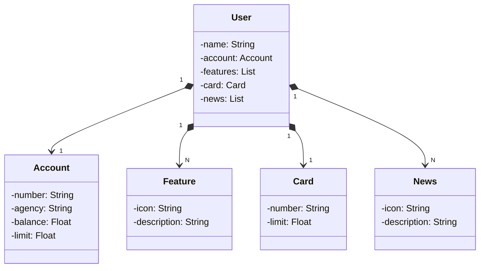

# API RESTful em JAVA
API RESTful construida em JAVA no Bootcamp Santander FullStack 

## Diagrama de Classes

```mermaid
classDiagram
    class User {
        -name: String
        -account: Account
        -features: List<Feature>
        -card: Card
        -news: List<News>
    }

    class Account {
        -number: String
        -agency: String
        -balance: Float
        -limit: Float
    }

    class Feature {
        -icon: String
        -description: String
    }

    class Card {
        -number: String
        -limit: Float
    }

    class News {
        -icon: String
        -description: String
    }

    User "1" *--> "1" Account
    User "1" *--> "N" Feature
    User "1" *--> "1" Card
    User "1" *--> "N" News
```